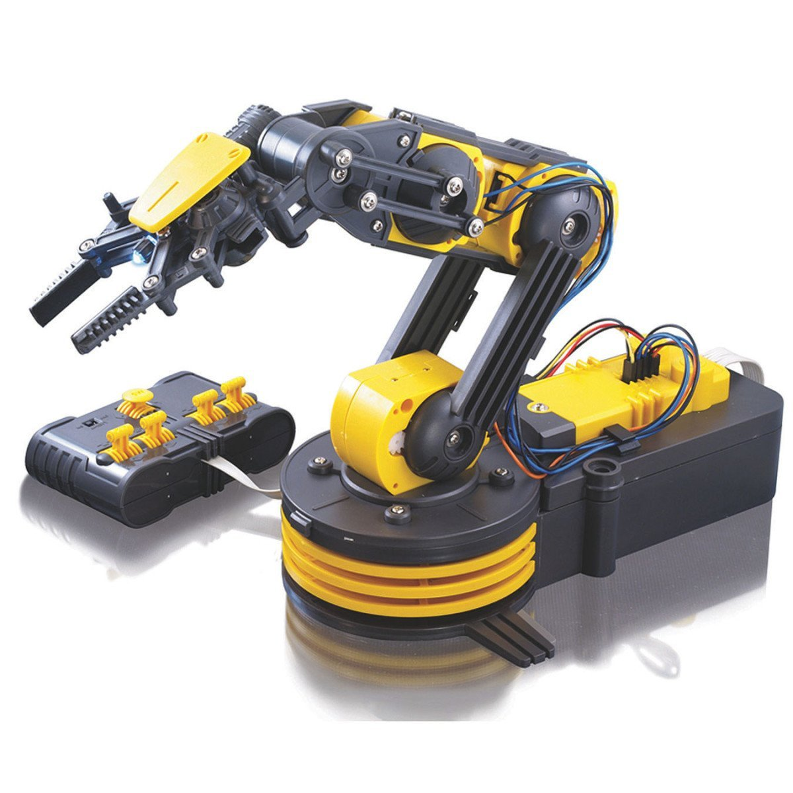

# OWI535-RoboticArm

<p align="center">
    
</p>

A C# library for controlling the OWI 535 Robotic Arm via USB interface. This project provides a simple API to control all movements of the robotic arm including rotation, arm movement, elbow control, claw operations, and light control.

## Features

- Complete control of OWI 535 Robotic Arm using C# API
- Individual joint movement (claw, elbow, arm)
- Rotation control
- Gripper control (open/close)
- LED light control
- Customizable movement durations
- Demo applications (Console and WPF)

## Requirements

- Windows OS with .NET Framework 4.5 or later
- OWI 535 Robotic Arm
- USB port

## Installation

1. Install the USB driver from the `1. Driver/OWI_535_Robotic_Arm/` directory
2. Connect the OWI 535 Robotic Arm to your computer via USB
3. Reference the `OWI535.Library.dll` in your project

## Project Structure

```
.
├── 1. Driver/                  # USB drivers for the robotic arm
├── 2. Library/                 # C# Library source code
├── 3. DLLs/                    # Compiled DLLs
└── 4. Demo Applications/       # Example applications
    ├── OWI535.Test.Console/    # Console application demo
    └── OWI535.Test.WPF/        # WPF application with GUI controls
```

## Usage Example

```csharp
using OWI535.Library;

// Create a new arm controller (VendorID=4711, ProductID=0, ArmID=0)
ArmController arm = new ArmController(4711, 0, 0);

// Control the arm
arm.LightOn();               // Turn on the LED
arm.ClawOpen(1000);          // Open the claw (duration: 1 second)
arm.ArmUp(2000);             // Move arm up (duration: 2 seconds)
arm.RotateLeft(1500);        // Rotate arm left (duration: 1.5 seconds)
arm.ClawClose(1000);         // Close the claw (duration: 1 second)
arm.LightOff();              // Turn off the LED

// Predefined action
arm.Handshake();             // Perform handshake action

// Always reset and disconnect when done
arm.Disconnect();
```

## API Reference

### ArmController Class

The main class for controlling the OWI 535 Robotic Arm.

#### Constructor

```csharp
public ArmController(Int32 VendorID, Int32 ProductID, Int32 ArmID)
```

- `VendorID`: The vendor ID of the OWI 535 Robotic Arm (usually 4711)
- `ProductID`: The product ID of the OWI 535 Robotic Arm (usually 0)
- `ArmID`: The arm ID (0 for first arm, 1 for second, etc.)

#### Methods

**Connections**
- `Reset()` - Stop all arm movements
- `Disconnect()` - Reset and disconnect the arm

**Claw Control**
- `ClawOpen(int sleepTime)` - Open the claw
- `ClawClose(int sleepTime)` - Close the claw
- `ClawUp(int sleepTime)` - Move the claw up
- `ClawDown(int sleepTime)` - Move the claw down

**Elbow Control**
- `ElbowUp(int sleepTime)` - Move the elbow up
- `ElbowDown(int sleepTime)` - Move the elbow down

**Arm Control**
- `ArmUp(int sleepTime)` - Move the arm up
- `ArmDown(int sleepTime)` - Move the arm down
- `RotateLeft(int sleepTime)` - Rotate the arm left
- `RotateRight(int sleepTime)` - Rotate the arm right

**Light Control**
- `LightOn()` - Turn the light on
- `LightOff()` - Turn the light off

**Predefined Actions**
- `Handshake()` - Perform a handshake action
- `FlashEye(int times)` - Flash the light a specific number of times

## Building from Source

1. Open `2. Library/OWI535.Library/OWI535.Library.sln` in Visual Studio
2. Build the solution to generate the library DLL
3. Reference the generated DLL in your projects

## Demo Applications

The repository includes two demo applications:

1. **Console Application**: Simple console-based demo of arm movements
   - Open `4. Demo Applications/OWI535.Test.sln` and run the Console project

2. **WPF Application**: GUI-based control of the robotic arm
   - Open `4. Demo Applications/OWI535.Test.sln` and run the WPF project

## Contributing

Contributions are welcome! Please feel free to submit a Pull Request.

## License

Copyright (c) Alexandros Sigaras. All rights reserved.

Licensed under the [MIT](LICENSE) License.